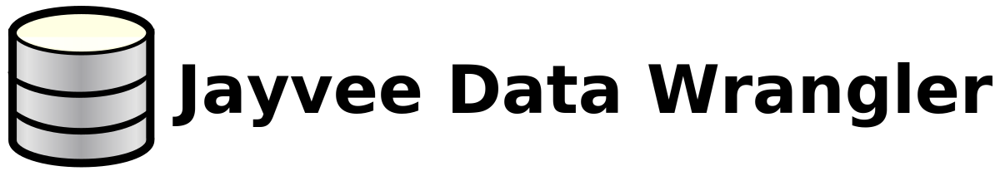

This software originated from a master's thesis, which aims to provide a free and open-source software to help researchers and data scientists with data wrangling tasks. The software is designed to be user-friendly. It's designed to help you with data wrangling tasks and automatically create executable scripts for Jayvee. If you have any questions or feedback, please feel free to contact me via E-Mail (jdw@derwebmaster.eu) or GitHub. I hope you enjoy using the Jayvee Data Wrangler!

# Installation Guide

Follow these steps to install the Jayvee Data Wrangler on your local machine:

## Prerequisites

Before you begin, ensure you have met the following requirements:

- You have a recent version of Node.js installed. If not, download it from [here](https://nodejs.org/en/download/).
- You have a recent version of npm (which comes with Node.js) or yarn installed. If not, you can install yarn using the command `npm install -g yarn`.

## Installing Jayvee Data Wrangler

To install the Jayvee Data Wrangler, follow these steps:

1. Clone the repository
2. Navigate to the project directory
3. Install the dependencies: `npm install` or if you are using yarn: `yarn install`
4. Start the application: `npm start` or if you are using yarn: `yarn start`
Now, you should be able to see the application running on your local machine.

## Troubleshooting

If you encounter any problems during the installation process, please check the [Node.js](https://nodejs.org/en/docs/) and [npm](https://docs.npmjs.com/) or [yarn](https://yarnpkg.com/getting-started) documentation. If you still have issues, feel free to contact me via E-Mail (jdw@derwebmaster.eu) or GitHub.

# Create an Executeable Application
You can create an executable application (using Electron) for your Operating System (Windows, Linux, or macOS). Please replace the parameter "-l" in the compile command on line 9 inside `package.json` with "w" if you are on Windows or "m" if you are on a Mac and run `npm run app` or `yarn run app`. 
This application uses SQLite, which relies on native bindings and needs to be built from scratch. Therefore, depending on your system, you might need to have C++ or Visual Studio installed. For more information, please visit https://github.com/nodejs/node-gyp.
If you have any other issues, you can read the documentation (https://www.electron.build/) of Electron build or contact me via E-Mail (jdw@derwebmaster.eu) or GitHub.

# How to use the Jayvee Data Wrangler?

Apart from importing data from a CSV on the internet into a SQLite database, you can also clean and filter the imported data, and view your previously imported projects. During the import or modification of data, a pipeline.jv file is created. The script contains executable code (Jayvee DSL language). The content of the CSV is imported into the database, as well as modified using this script. Programmers can also modify and execute it using the DSL Jayvee. Further information about Jayvee can be found in the official documentation: https://jvalue.github.io/jayvee/

## 1\. Load Data

You can import data from a CSV file via a URL into a SQLite database. You will be guided through the import process step by step. First, you will have to create a new project. The underlying procedure will create a folder in a workspace-folder that is located inside the application configuration files (e.g. ∼/.config/jayvee−data−wrangler/workspace/example on Linux or C:\Users\YourUsername\AppData\Roaming\jayvee-data-wrangler\ on Windows). Keep in mind that you have to choose different project names, as the software does not override existing folders. After this, you can proceed with the data import. As far as possible, all metadata and the header will be detected automatically. If at any point something's not detected automatically, you can manually adjust the settings. You can adjust the following parameters:

*   Encoding: Every CSV file is encoded in a special format. If the encoding is not supported or not recognized automatically, a dropdown with all supported encodings you can choose from is shown.
*   Delimiter: A character that distinguishes the entries within a row. If it is automatically detected but not visible, it may be the space character that goes unnoticed. Typical delimiters are ',', ';', '\t', '|', ':', ' ', but you can set any character as a delimiter.
*   Enclosing: A character that serves the purpose of enclosing the entries within a row. Typical enclosing characters are " and ', but it is possible that there is no enclosing character. You can also set any character as enclosing, but it has to differ from the delimiter.

If the header is not detected, the software automatically creates column names. Also, duplicate column names are automatically renamed by adding unique numbers. Note that detecting metadata and importing the CSV into a database might take some time.

## 2\. Open Project Folder

You can open the project folder in the system's file explorer with a button click. Inside the project folder there are a Jayvee file (pipeline.jv), the database, a metadata database and the CSV file. You can modify the database, but keep in mind that changes to the database are visible in the Jayvee Data Wrangler when a project is loaded, as it loads the contents of the database. Once a CSV has been imported into a database, modifying the Jayvee file or CSV file has no influence on the data (if you don't execute the Jayvee file) and therefore not on the behavior of the Jayvee Data Wrangler. Please don't modify the metadata database.

## 3\. View Database/ Clean Data

After successfully importing a CSV into a database (or if you view existing projects), you can clean your data by removing columns and rows, renaming headers, changing value types of columns and creating custom value types with custom constraints. In particular, custom value types enable a wide range of data filtering options. You will see all changes immediately. The changes you make will only affect the database and the ETL pipeline when you save them.

You can make the following changes by clicking on the respective button:

*   Edit column names: You can rename a column header using the letters a-z and A-Z
*   Delete columns and rows
*   Create custom value types with custom constraints to filter the data
*   Change the value type of a column 

## 4\. Create Custom Value Types with Custom Constraints

You can create custom value types with custom constraints. This enables a wide range of data filtering options. You will be guided through the process of creating custom value types with constraints. After creating these, you will be able to use value types for filtering the data of a column. Note: You have to create constraints first to use them with your custom value types. The constraints are also saved within the metadata database in the project folder.

Constraints have a built in value type (text, integer or decimal) and a constraint. They have to be chosen from one of the following:

*   Regular expressions
*   List of allowed values
*   List of denied values
*   Range constraints
*   Length constraints

These constraints restrict the possible values of a value type. After creating a constraint, a value type can be created. Value types have a built-in value type and one or more constraints of the same built-in value type.

You can read more about constraints and value types in the Jayvee documentation: https://jvalue.github.io/jayvee/docs/category/constraint-types

## 5\. Visualize Data/ Statistics

To get a better understanding of the data, statistics are created for every column depending on the datatype of the column by clicking the statistics button of a column.

## 6\. Delete Rows or Columns

You can delete rows or columns by clicking the respective delete button. 

## 7\. Save Changes

All changes made to the database are temporary and can be undone until you click the save button. The changes are saved in the original database and original ETL pipeline within your project folder. If you want to keep previous versions of the database and ETL pipeline, you have to copy the files to another folder or duplicate the project folder.

If an error occurs during saving, you can undo changes and try saving again or abort the changes by navigating to the home page.

## 8\. Open Previous Projects

You can open previous projects from the start page. The projects are saved in the workspace directory. All folders within the workspace are interpreted as projects. An opened project can then be edited (e.g. delete rows, create value types).

## 9\. Delete Projects

Projects can be deleted by removing their project folder from the file system using the operating system's file explorer. 

## 10\. Disclaimer

The Jayvee Data Wrangler is provided 'as is', without any warranty. You are responsible for all inputs. If you insert a URL, the Jayvee Data Wrangler downloads the file the URL points to your device. You are responsible for checking the URL and the content of the file before you use it in this software.

# License

The Jayvee Data Wrangler is a free software. It is licensed under the [MIT License](./LICENSE.md). This means you can use, modify, and distribute the software as you wish. However, the software is provided 'as is', without any warranty. For more information, please read the [License](./LICENSE.md).